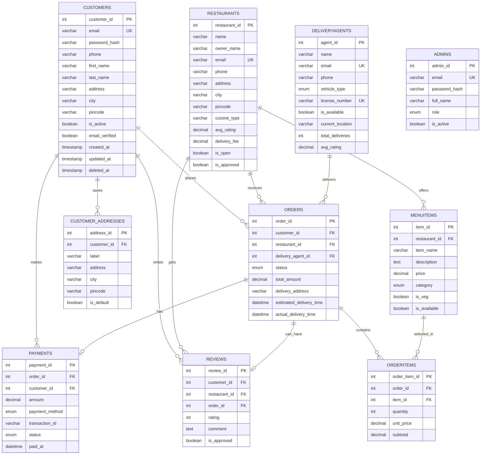

# FoodDash

FoodDash is a full-stack food delivery application with a customer-facing React app, an admin dashboard, and a Node.js/Express/MySQL REST API.

## Features

- Customer registration and login
- Customer profile editing and saved delivery addresses
- Restaurant discovery and filtering
- Restaurant details, menus, and reviews
- Cart and checkout flow
- Customer order history and order tracking
- Admin login with separate admin JWT authentication
- Admin dashboard, analytics, user management, restaurant management, delivery-agent management, order assignment, and order management
- Restaurant-owner dashboard for profile, menu, order queue, and restaurant analytics
- Public restaurant partner registration with admin approval
- MySQL schema, seed data, views, triggers, and admin table migration

## Tech Stack

- Frontend: React, Vite, React Router, Lucide icons
- Backend: Node.js, Express, MySQL, JWT, bcrypt, Joi
- Database: MySQL
- Testing: Jest, Supertest

## Project Structure

```text
FoodDash/
  backend/              Express API
  database/             MySQL migrations and seed data
  frontend/             React + Vite app
  architecture-guide.md Project architecture notes
  project-analysis.md   Project analysis notes
```

## Prerequisites

Install these before setup:

- Node.js 20 or newer
- npm
- MySQL Server
- Git

## Quick Start

If MySQL is already installed and running, this is the shortest local setup path:

```bash
git clone <your-repository-url>
cd FoodDash

cd backend
npm install
copy .env.example .env
```

Edit `backend/.env` with your MySQL password, JWT secret, and admin credentials. Then run:

```bash
npm run db:migrate
npm run db:seed
npm run db:admin
npm run db:restaurant-auth
npm run db:addresses
npm run db:create-admin
npm run dev
```

In a second terminal:

```bash
cd frontend
npm install
copy .env.example .env
npm run dev
```

Open:

```text
http://localhost:5173
```

Use these dashboards:

```text
Customer app: http://localhost:5173
Admin panel: http://localhost:5173/admin/login
Restaurant dashboard: http://localhost:5173/restaurant/login
Restaurant registration: http://localhost:5173/restaurant/register
```

If you still need to install MySQL on Windows, follow [WINDOWS_MYSQL_INSTALLATION.md](./WINDOWS_MYSQL_INSTALLATION.md) first.

### Full Setup

Clone the project:

```bash
git clone <your-repository-url>
cd FoodDash
```

Install backend dependencies:

```bash
cd backend
npm install
```

Create backend environment file:

```bash
copy .env.example .env
```

On macOS/Linux, use:

```bash
cp .env.example .env
```

Edit `backend/.env` with your local MySQL password and private secrets:

```env
NODE_ENV=development
PORT=5000
CORS_ORIGIN=http://localhost:5173,http://localhost:5174

DB_HOST=localhost
DB_PORT=3306
DB_NAME=fooddash
DB_USER=root
DB_PASSWORD=your_mysql_password
DB_CONNECTION_LIMIT=10

JWT_SECRET=replace_with_a_long_secret_at_least_32_chars
JWT_EXPIRES_IN=7d
BCRYPT_ROUNDS=10

ADMIN_EMAIL=your_admin_email@example.com
ADMIN_PASSWORD=your_private_admin_password
ADMIN_NAME=FoodDash Admin
```

Create and seed the database:

```bash
npm run db:migrate
npm run db:seed
npm run db:admin
npm run db:restaurant-auth
npm run db:addresses
npm run db:create-admin
```

Start the backend:

```bash
npm run dev
```

The API will run at:

```text
http://localhost:5000
```

In a second terminal, install frontend dependencies:

```bash
cd frontend
npm install
```

Create frontend environment file:

```bash
copy .env.example .env
```

On macOS/Linux, use:

```bash
cp .env.example .env
```

Start the frontend:

```bash
npm run dev
```

Open:

```text
http://localhost:5173
```

## App URLs

Customer app:

```text
http://localhost:5173
```

Admin login:

```text
http://localhost:5173/admin/login
```

Restaurant owner login:

```text
http://localhost:5173/restaurant/login
```

Restaurant partner registration:

```text
http://localhost:5173/restaurant/register
```

Backend health check:

```text
http://localhost:5000/health
```

## Admin Account

The admin account is created from values in `backend/.env`.

Set these before running `npm run db:create-admin`:

```env
ADMIN_EMAIL=your_admin_email@example.com
ADMIN_PASSWORD=your_private_admin_password
ADMIN_NAME=FoodDash Admin
```

Then run:

```bash
cd backend
npm run db:create-admin
```

Admin credentials are stored securely in MySQL using bcrypt hashes. If you forget the admin password, update `ADMIN_PASSWORD` in `backend/.env` and run `npm run db:create-admin` again.

## Restaurant Owner Dashboard

Restaurant owners have their own dashboard separate from customer and admin areas.

Open:

```text
http://localhost:5173/restaurant/login
```

Seeded demo restaurant owner credentials:

```text
Email: spiceroute@example.com
Password: restaurant@123
```

Other seeded restaurant emails also use the same demo password after `npm run db:restaurant-auth`:

```text
wokexpress@example.com
greenbowl@example.com
```

Restaurant owner pages:

- `/restaurant` dashboard with revenue, orders, pending orders, menu count, recent orders, and top items
- `/restaurant/menu` add, edit, hide, and toggle menu items
- `/restaurant/orders` view incoming orders and update restaurant-controlled statuses
- `/restaurant/profile` update restaurant profile, delivery fee, cuisine, address, and open/closed status

Restaurant owners can only access their own restaurant data. The backend signs restaurant-owner JWTs with `role: "restaurant"` and all restaurant-owner APIs are scoped to `req.user.sub`, which is the logged-in restaurant id.

New restaurants can self-register at `/restaurant/register`. These registrations are saved as pending listings, so an admin must approve the restaurant before it appears in customer search and before the owner uses the live dashboard.

## Backend Scripts

Run these from `backend/`:

```bash
npm run dev             # Start API with nodemon
npm start               # Start API with node
npm run db:migrate      # Create/recreate main database schema
npm run db:seed         # Insert sample data
npm run db:admin        # Create admin table
npm run db:restaurant-auth # Add/reset restaurant owner auth for existing restaurants
npm run db:addresses    # Add customer saved-address table and migrate existing addresses
npm run db:create-admin # Create or reset admin account
npm run lint            # Syntax check backend entrypoint
npm test                # Run backend tests
```

## Frontend Scripts

Run these from `frontend/`:

```bash
npm run dev     # Start Vite development server
npm run build   # Build production frontend
npm run preview # Preview production build
npm run lint    # Run ESLint
```

## API Routes

Customer auth:

- `POST /api/auth/register`
- `POST /api/auth/login`

Customer profile:

- `GET /api/customers/me`
- `PUT /api/customers/me`
- `GET /api/customers/addresses`
- `POST /api/customers/addresses`
- `PUT /api/customers/addresses/:addressId`
- `DELETE /api/customers/addresses/:addressId`

Restaurants:

- `GET /api/restaurants`
- `POST /api/restaurants`
- `GET /api/restaurants/:id`
- `GET /api/restaurants/:id/menu`
- `GET /api/restaurants/:id/reviews`

Orders:

- `POST /api/orders`
- `GET /api/orders/my-orders`
- `GET /api/orders/:id`

Payments:

- `POST /api/payments`

Reviews:

- `POST /api/reviews`

Admin:

- `POST /api/admin/auth/login`
- `GET /api/admin/me`
- `GET /api/admin/dashboard`
- `GET /api/admin/analytics`
- `GET /api/admin/users`
- `GET /api/admin/users/:id`
- `PATCH /api/admin/users/:id/status`
- `DELETE /api/admin/users/:id`
- `GET /api/admin/restaurants`
- `POST /api/admin/restaurants`
- `GET /api/admin/restaurants/:id`
- `PUT /api/admin/restaurants/:id`
- `PATCH /api/admin/restaurants/:id/approval`
- `DELETE /api/admin/restaurants/:id`
- `GET /api/admin/orders`
- `GET /api/admin/orders/:id`
- `PATCH /api/admin/orders/:id/status`
- `GET /api/admin/delivery-agents`
- `POST /api/admin/delivery-agents`
- `PUT /api/admin/delivery-agents/:id`
- `DELETE /api/admin/delivery-agents/:id`

Restaurant owner:

- `POST /api/restaurant-owner/auth/login`
- `GET /api/restaurant-owner/me`
- `GET /api/restaurant-owner/dashboard`
- `PUT /api/restaurant-owner/profile`
- `GET /api/restaurant-owner/menu`
- `POST /api/restaurant-owner/menu`
- `PUT /api/restaurant-owner/menu/:itemId`
- `DELETE /api/restaurant-owner/menu/:itemId`
- `GET /api/restaurant-owner/orders`
- `GET /api/restaurant-owner/orders/:orderId`
- `PATCH /api/restaurant-owner/orders/:orderId/status`

Admin routes except login require:

```text
Authorization: Bearer <admin_jwt_token>
```

Customer routes that require login use:

```text
Authorization: Bearer <customer_jwt_token>
```

## Database Guide

FoodDash uses MySQL as the main relational database. The database is designed around a food-delivery workflow: customers browse restaurants, add menu items to an order, pay for the order, optionally get assigned a delivery agent, and then leave a review.

The database scripts live in `database/`.

- `database/migrations/001_create_fooddash_schema.sql` creates the main FoodDash schema.
- `database/migrations/002_create_admin_system.sql` creates the admin table.
- `database/migrations/003_add_restaurant_owner_auth.sql` adds restaurant-owner dashboard password support.
- `database/migrations/004_create_customer_addresses.sql` adds saved customer addresses and backfills existing profile addresses.
- `database/seeds/001_seed_fooddash.sql` inserts sample customers, restaurants, delivery agents, menu items, an order, payment, and review.

Current sample data is centered around Vijayawada.

Warning: `npm run db:migrate` recreates the main schema and can drop existing local data. Use it carefully once you have real data.

### Database Setup Flow

Run the database scripts in this order from `backend/`:

```bash
npm run db:migrate      # Creates database, main tables, indexes, views, triggers
npm run db:seed         # Inserts sample customer/restaurant/order data
npm run db:admin        # Creates admins table
npm run db:restaurant-auth # Adds restaurant owner password hashes for seeded/existing restaurants
npm run db:addresses    # Creates saved addresses and imports existing customer profile addresses
npm run db:create-admin # Creates or resets the private admin account
```

The backend reads database credentials from `backend/.env` through `backend/src/database/connection.js`. Queries use a MySQL connection pool, so the API can reuse connections instead of opening a new database connection for every request.

### ER Diagram

This Mermaid diagram shows the main entity relationships. GitHub renders Mermaid diagrams automatically in Markdown.



### Tables and Purpose

`customers`

Stores customer accounts, login password hashes, contact information, saved address/city, account status, and soft-delete metadata.

`customer_addresses`

Stores multiple delivery addresses per customer, including label, city, pincode, and default-address flag.

`restaurants`

Stores restaurant profiles, owner details, cuisine, city, delivery fee, approval status, and average rating.

`deliveryagents`

Stores delivery partner details, vehicle type, license number, availability, current location, total deliveries, and rating.

`menuitems`

Stores food items offered by each restaurant. Every menu item belongs to one restaurant through `restaurant_id`.

`orders`

Stores order headers: who ordered, which restaurant receives the order, assigned delivery agent, status, total amount, delivery address, and delivery timestamps.

`orderitems`

Bridge table between `orders` and `menuitems`. It stores each selected menu item, quantity, unit price at order time, and subtotal.

`payments`

Stores payment records for orders, including payment method, amount, transaction id, status, and paid time.

`reviews`

Stores customer reviews for restaurants. A review belongs to a customer, restaurant, and order.

`admins`

Stores admin users separately from customers. Admin passwords are bcrypt-hashed and admin APIs require an admin JWT.

### Relationship Rules

- One customer can place many orders.
- One customer can save many delivery addresses.
- One restaurant can receive many orders.
- One restaurant can have many menu items.
- One order can contain many order items.
- One menu item can appear in many order items.
- One customer can make many payments.
- One order has one payment record.
- One delivery agent can deliver many orders.
- One customer can write many reviews.
- One restaurant can receive many reviews.
- One order can have one review.
- Admins are intentionally separate from customers for role-based access control.

### How Ordering Works in the Database

1. A customer logs in and receives a customer JWT.
2. The customer can manage default profile details and saved delivery addresses in `customer_addresses`.
3. The frontend loads restaurants from `restaurants`.
4. The frontend loads menu items from `menuitems` for the selected restaurant.
5. On checkout, the backend creates one row in `orders`.
6. The backend creates multiple rows in `orderitems`, one per cart item.
7. The `trg_orderitems_before_insert` trigger calculates each `orderitems.subtotal`.
8. The backend creates or updates a row in `payments`.
9. Admins can update order status from the admin panel.
10. When an order becomes delivered, `trg_orders_after_update` increments the delivery agent's `total_deliveries`.
11. A customer can review the delivered order.
12. When a review is inserted, `trg_reviews_after_insert` recalculates the restaurant's `avg_rating`.

### Views

The schema creates two database views for reporting and admin screens.

`v_restaurant_sales`

Aggregates restaurant sales:

- Restaurant id
- Restaurant name
- Total orders
- Total revenue
- Average order value

`v_order_details`

Combines order, customer, restaurant, and payment information:

- Order id
- Order status
- Order time
- Customer name
- Restaurant name
- Total amount
- Payment method
- Payment status

### Triggers

`trg_orderitems_before_insert`

Runs before inserting into `orderitems`. It calculates:

```text
subtotal = quantity * unit_price
```

`trg_reviews_after_insert`

Runs after a review is inserted. It recalculates `restaurants.avg_rating` from approved reviews.

`trg_orders_after_update`

Runs after an order is updated. If the order becomes `delivered` and has a delivery agent, it increments that agent's `total_deliveries` and marks the agent available.

### Indexes

The schema adds indexes for common lookup/filter paths:

- `customers.phone`
- `customers.city`
- `restaurants.city`
- `restaurants.cuisine_type`
- `restaurants.avg_rating`
- `menuitems.restaurant_id`
- `menuitems.category`
- `orders.customer_id`
- `orders.restaurant_id`
- `orders.status`
- `orders.order_time`
- `orderitems.order_id`
- `orderitems.item_id`
- `payments.status`
- `reviews.restaurant_id`
- `reviews.customer_id`
- `admins.email`

These indexes support searches such as restaurants by city/cuisine, customer orders, order status filters, and admin lookups.

### Normalization

The schema is designed around normalized relational tables:

- Customer data is stored once in `customers`.
- Restaurant data is stored once in `restaurants`.
- Menu items are separate from restaurants to avoid repeating restaurant details for every item.
- Orders are split into `orders` and `orderitems` so one order can contain multiple items.
- Payments are separate from orders so payment state can evolve independently.
- Reviews are separate from orders and restaurants, while still linked through foreign keys.

This avoids duplicate data, keeps updates safer, and makes reporting queries easier.

### Useful SQL Queries

Find approved open restaurants in Vijayawada:

```sql
SELECT restaurant_id, name, cuisine_type, avg_rating, delivery_fee
FROM restaurants
WHERE city = 'Vijayawada'
  AND is_open = TRUE
  AND is_approved = TRUE
  AND deleted_at IS NULL
ORDER BY avg_rating DESC;
```

Get a customer's recent orders:

```sql
SELECT o.order_id, r.name AS restaurant_name, o.status, o.total_amount, o.order_time
FROM orders o
JOIN restaurants r ON r.restaurant_id = o.restaurant_id
WHERE o.customer_id = 1
ORDER BY o.order_time DESC;
```

Get order details with menu items:

```sql
SELECT
  o.order_id,
  r.name AS restaurant_name,
  m.item_name,
  oi.quantity,
  oi.unit_price,
  oi.subtotal
FROM orders o
JOIN restaurants r ON r.restaurant_id = o.restaurant_id
JOIN orderitems oi ON oi.order_id = o.order_id
JOIN menuitems m ON m.item_id = oi.item_id
WHERE o.order_id = 1;
```

Get restaurant sales from the view:

```sql
SELECT restaurant_id, restaurant_name, total_orders, total_revenue, average_order_value
FROM v_restaurant_sales
ORDER BY total_revenue DESC;
```

### Database Safety Notes

- Do not commit `backend/.env`; it contains database credentials.
- Use a long private `JWT_SECRET`.
- Use a separate production database user with limited permissions when deploying.
- Back up production data before running migrations.
- Do not run `npm run db:migrate` against production unless you intentionally want to recreate the schema.

## Environment Files

Do not commit real `.env` files.

This project includes examples:

- `backend/.env.example`
- `frontend/.env.example`

The root `.gitignore` excludes:

- `.env`
- `backend/.env`
- `frontend/.env`
- `node_modules/`
- logs
- coverage
- `frontend/dist/`

## Verification Before Pushing

Run these checks before opening a pull request or pushing changes:

```bash
cd backend
npm run lint
npm test
```

```bash
cd frontend
npm run lint
npm run build
```

## Troubleshooting

Port `5000` already in use:

```text
EADDRINUSE: address already in use :::5000
```

Another backend process is already running. Stop the old Node process or change `PORT` in `backend/.env`.

Frontend cannot reach backend:

- Make sure the backend is running on `http://localhost:5000`.
- Check `frontend/.env` has `VITE_API_BASE_URL=http://localhost:5000/api`.
- Make sure `CORS_ORIGIN` in `backend/.env` includes the frontend URL.

Admin login fails:

- Use `http://localhost:5173/admin/login`, not the customer login page.
- Confirm `ADMIN_EMAIL` and `ADMIN_PASSWORD` are set in `backend/.env`.
- Run `npm run db:admin`.
- Run `npm run db:create-admin`.

Restaurant owner login fails:

- Use `http://localhost:5173/restaurant/login`, not the customer login page.
- Run `npm run db:restaurant-auth` from `backend/`.
- Try a seeded restaurant email such as `spiceroute@example.com`.
- Use the seeded demo password `restaurant@123`.

Database connection fails:

- Make sure MySQL Server is running.
- Confirm `DB_USER`, `DB_PASSWORD`, `DB_HOST`, `DB_PORT`, and `DB_NAME` in `backend/.env`.
- Run `npm run db:migrate` before starting the backend for the first time.

## GitHub Setup

If this folder is not already a Git repository:

```bash
git init
git add .
git commit -m "Initial FoodDash project"
git branch -M main
git remote add origin <your-repository-url>
git push -u origin main
```

Make sure your real `.env` files are not committed.
