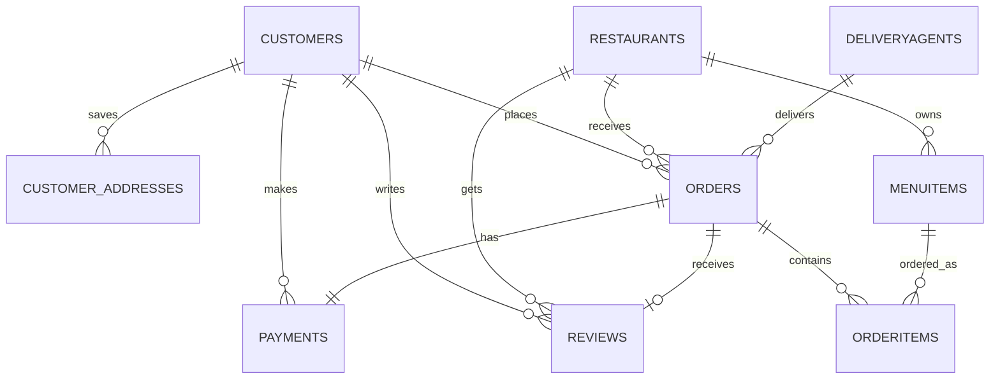

# FoodDash Database Guide

This folder contains the MySQL database implementation for FoodDash. The database stores customers, restaurants, menu items, orders, delivery agents, payments, reviews, and saved addresses.


## Quick Reference

| Task | Command |
|------|---------|
| Connect to MySQL | `mysql -u root -p` |
| Show databases | `SHOW DATABASES;` |
| Create database | `CREATE DATABASE fooddash;` |
| Use database | `USE fooddash;` |
| Show tables | `SHOW TABLES;` |
| Exit MySQL | `EXIT;` |
| Start MySQL service | `net start MySQL80` |
| Stop MySQL service | `net stop MySQL80` |


## Files

- `migrations/001_create_fooddash_schema.sql`: Creates the main database, tables, foreign keys, indexes, views, and triggers.
- `migrations/002_create_admin_system.sql`: Creates the admin authentication table.
- `migrations/003_add_restaurant_owner_auth.sql`: Adds restaurant-owner password support for the restaurant dashboard.
- `migrations/004_create_customer_addresses.sql`: Adds saved customer addresses and backfills existing customer profile addresses.
- `seeds/001_seed_fooddash.sql`: Adds sample customers, restaurants, delivery agents, menu items, an order, payment, and review.

## Run Database Setup

Recommended setup from the backend folder:

```bash
cd backend
npm run db:migrate
npm run db:seed
npm run db:admin
npm run db:restaurant-auth
npm run db:addresses
npm run db:create-admin
```

Important:

- `npm run db:migrate` runs the main schema file and recreates core tables. Use it for local setup/reset, not against production data.
- `npm run db:seed` inserts demo data for testing.
- `npm run db:create-admin` creates or updates the admin login from `backend/.env`.

You can also run the SQL files manually from the project root:

```bash
mysql -u root -p < database/migrations/001_create_fooddash_schema.sql
mysql -u root -p fooddash < database/seeds/001_seed_fooddash.sql
mysql -u root -p fooddash < database/migrations/002_create_admin_system.sql
mysql -u root -p fooddash < database/migrations/003_add_restaurant_owner_auth.sql
mysql -u root -p fooddash < database/migrations/004_create_customer_addresses.sql
```

Seeded restaurant owners can log in with their restaurant email and the demo password `restaurant@123`.

The database stores only bcrypt password hashes. The demo password is documented for local development; it is not decoded from the hash.

## ER Diagram



## Main Tables

`customers`

Stores customer login and profile data such as email, bcrypt password hash, phone, name, address, city, pincode, status, and timestamps.

`customer_addresses`

Stores multiple saved delivery addresses for one customer. This keeps address-book data separate from the main customer profile.

`restaurants`

Stores restaurant profile, owner details, email, bcrypt password hash, cuisine, address, delivery fee, open/closed status, approval status, and average rating.

`menuitems`

Stores food items for each restaurant. Every menu item belongs to one restaurant through `restaurant_id`.

`orders`

Stores the order header: customer, restaurant, optional delivery agent, order status, total amount, delivery address, and delivery timing.

`orderitems`

Stores the individual food items inside an order. This table connects one order with many menu items.

`payments`

Stores payment information for an order: amount, method, transaction id, payment status, and paid time.

`reviews`

Stores customer reviews after delivered orders. Each order can have only one review.

`deliveryagents`

Stores delivery agent details such as name, email, phone, vehicle type, license number, availability, current location, total deliveries, and rating.

`admins`

Created by `002_create_admin_system.sql`. Stores admin accounts separately from customers and restaurants. It is an authentication and role-management table, so it does not need a foreign-key relationship with food-ordering tables.

## Data Integrity Rules

The schema uses several rules to keep the data valid:

- Primary keys uniquely identify each row, such as `customer_id`, `restaurant_id`, and `order_id`.
- Foreign keys connect related tables and prevent invalid references.
- Unique constraints prevent duplicate emails and duplicate delivery-agent license numbers.
- Enums restrict fixed values such as order status, payment method, payment status, vehicle type, and menu category.
- The review rating check ensures ratings stay between `1` and `5`.
- Soft-delete fields like `deleted_at` allow customers and restaurants to be hidden without immediately removing historical records.

## Why Order_Items Table?

An order can contain more than one food item. A menu item can also appear in many different orders.

That is a many-to-many relationship:

```text
orders <-> menuitems
```

Relational databases should not store many menu items inside one column like this:

```text
order_id = 1
items = "Paneer Butter Masala, Garlic Naan, Mango Smoothie"
```

That design is hard to query, update, total, and validate.

Instead, FoodDash uses `orderitems` as a bridge table:

```text
orders.order_id -> orderitems.order_id
menuitems.item_id -> orderitems.item_id
```

Example:

| order_item_id | order_id | item_id | quantity | unit_price | subtotal |
|---|---:|---:|---:|---:|---:|
| 1 | 1 | 1 | 1 | 240.00 | 240.00 |
| 2 | 1 | 3 | 2 | 55.00 | 110.00 |

This means order `1` contains two different menu items.

Benefits:

- One order can contain multiple items.
- Quantity can be stored per item.
- Historical `unit_price` is preserved even if menu price changes later.
- Subtotal can be calculated per item.
- Reporting becomes easy, such as finding top-selling menu items.

## What Is Normalization?

Normalization is the process of organizing data into separate related tables to reduce duplication and improve data consistency.

Without normalization, an order table might repeat customer and restaurant details every time:

```text
order_id, customer_name, customer_email, restaurant_name, restaurant_phone, item_names
```

That creates problems:

- Customer email is repeated in many rows.
- Restaurant details are repeated in many rows.
- Updating a phone number requires many updates.
- Data can become inconsistent.

FoodDash uses normalized tables:

- Customer data is stored once in `customers`.
- Restaurant data is stored once in `restaurants`.
- Menu item data is stored once in `menuitems`.
- Order header data is stored in `orders`.
- Order item lines are stored in `orderitems`.
- Payment data is stored in `payments`.

Example:

```text
customers.customer_id = 1
orders.customer_id = 1
```

The order stores only the customer id, not the full customer profile again.

## Which Normalization Form Is Used?

FoodDash is mainly designed up to Third Normal Form, also called `3NF`.

Some values are intentionally stored as calculated snapshots for practical reasons:

- `orderitems.subtotal`: stores the item subtotal at the time of order.
- `orders.total_amount`: stores the final order amount at checkout time.
- `restaurants.avg_rating`: stores the current average rating for faster restaurant listings.

These fields are controlled by backend logic and triggers. They are acceptable controlled denormalizations because they preserve order history and improve read performance.

### First Normal Form

First Normal Form means every column should store a single atomic value. A column should not store a list of values.

Bad design:

```text
order_id = 1
items = "Paneer Butter Masala, Garlic Naan, Mango Smoothie"
```

FoodDash avoids this by storing each ordered item as a separate row in `orderitems`.

Good design:

| order_item_id | order_id | item_id | quantity |
|---|---:|---:|---:|
| 1 | 1 | 1 | 1 |
| 2 | 1 | 3 | 2 |

So FoodDash follows `1NF`.

### Second Normal Form

Second Normal Form means the table should already be in `1NF`, and each non-key column should depend on the full primary key or the main purpose of that table.

FoodDash separates data by purpose:

- Customer details are stored in `customers`.
- Restaurant details are stored in `restaurants`.
- Menu item details are stored in `menuitems`.
- Order header details are stored in `orders`.
- Ordered item quantities are stored in `orderitems`.

For example, item quantity belongs to `orderitems`, not `menuitems`, because quantity changes per order.

So FoodDash follows `2NF`.

### Third Normal Form

Third Normal Form means the table should already be in `2NF`, and non-key columns should not depend on other non-key columns.

Example:

The `orders` table stores:

```text
order_id
customer_id
restaurant_id
delivery_agent_id
status
total_amount
delivery_address
```

It does not store:

```text
customer_name
customer_email
restaurant_name
restaurant_phone
```

Those values belong to `customers` and `restaurants`.

When the app needs full order details, it uses a `JOIN`:

```sql
SELECT
  o.order_id,
  c.email AS customer_email,
  r.name AS restaurant_name,
  o.total_amount
FROM orders o
JOIN customers c ON c.customer_id = o.customer_id
JOIN restaurants r ON r.restaurant_id = o.restaurant_id;
```

This avoids duplicate customer and restaurant data inside `orders`.

So FoodDash follows `3NF` for core entity relationships, with controlled calculated fields for performance and historical accuracy.

### Short Answer

FoodDash uses normalization up to `3NF`, with a few controlled calculated fields such as `subtotal`, `total_amount`, and `avg_rating`.

The database uses separate tables such as `customers`, `restaurants`, `menuitems`, `orders`, `orderitems`, `payments`, and `reviews` to reduce duplicate data, maintain consistency, and properly represent one-to-many and many-to-many relationships.

## Important Relationships

One customer can place many orders:

```text
customers.customer_id -> orders.customer_id
```

One restaurant can have many menu items:

```text
restaurants.restaurant_id -> menuitems.restaurant_id
```

One restaurant can receive many orders:

```text
restaurants.restaurant_id -> orders.restaurant_id
```

One order can contain many order items:

```text
orders.order_id -> orderitems.order_id
```

One menu item can appear in many order items:

```text
menuitems.item_id -> orderitems.item_id
```

One order has one payment:

```text
orders.order_id -> payments.order_id
```

One delivered order can have one review:

```text
orders.order_id -> reviews.order_id
```

One delivery agent can be assigned to many orders over time:

```text
deliveryagents.agent_id -> orders.delivery_agent_id
```

## Example JOIN

This query shows order details with customer, restaurant, payment, and delivery agent information:

```sql
SELECT
  o.order_id,
  o.status,
  o.order_time,
  CONCAT(c.first_name, ' ', COALESCE(c.last_name, '')) AS customer_name,
  r.name AS restaurant_name,
  da.name AS delivery_agent_name,
  o.total_amount,
  p.payment_method,
  p.status AS payment_status
FROM orders o
JOIN customers c ON c.customer_id = o.customer_id
JOIN restaurants r ON r.restaurant_id = o.restaurant_id
LEFT JOIN deliveryagents da ON da.agent_id = o.delivery_agent_id
LEFT JOIN payments p ON p.order_id = o.order_id
ORDER BY o.order_time DESC;
```

Why different JOIN types are used:

- `JOIN customers`: every order must have a customer.
- `JOIN restaurants`: every order must have a restaurant.
- `LEFT JOIN deliveryagents`: an order may not be assigned yet.
- `LEFT JOIN payments`: payment may still be pending or not created in some edge cases.

## Example Order Items JOIN

This query shows all food items inside a specific order:

```sql
SELECT
  o.order_id,
  mi.item_name,
  oi.quantity,
  oi.unit_price,
  oi.subtotal
FROM orders o
JOIN orderitems oi ON oi.order_id = o.order_id
JOIN menuitems mi ON mi.item_id = oi.item_id
WHERE o.order_id = 1;
```

This is possible because `orderitems` connects `orders` and `menuitems`.

## Example Trigger

FoodDash uses triggers to keep calculated data consistent.

### Trigger: Calculate Order Item Subtotal

```sql
CREATE TRIGGER trg_orderitems_before_insert
BEFORE INSERT ON orderitems
FOR EACH ROW
BEGIN
  SET NEW.subtotal = NEW.quantity * NEW.unit_price;
END;
```

Purpose:

- Runs before a row is inserted into `orderitems`.
- Automatically calculates `subtotal`.
- Prevents manual mistakes in subtotal calculation.

Example:

```text
quantity = 2
unit_price = 55.00
subtotal = 110.00
```

### Trigger: Update Restaurant Rating

```sql
CREATE TRIGGER trg_reviews_after_insert
AFTER INSERT ON reviews
FOR EACH ROW
BEGIN
  UPDATE restaurants
  SET avg_rating = (
    SELECT ROUND(AVG(rating), 2)
    FROM reviews
    WHERE restaurant_id = NEW.restaurant_id AND is_approved = TRUE
  )
  WHERE restaurant_id = NEW.restaurant_id;
END;
```

Purpose:

- Runs after a customer review is inserted.
- Recalculates the restaurant's average rating.
- Keeps `restaurants.avg_rating` updated automatically.

### Trigger: Update Delivery Agent After Delivery

```sql
CREATE TRIGGER trg_orders_after_update
AFTER UPDATE ON orders
FOR EACH ROW
BEGIN
  IF NEW.status = 'delivered' AND OLD.status <> 'delivered' AND NEW.delivery_agent_id IS NOT NULL THEN
    UPDATE deliveryagents
    SET total_deliveries = total_deliveries + 1,
        is_available = TRUE
    WHERE agent_id = NEW.delivery_agent_id;
  END IF;
END;
```

Purpose:

- Runs when an order is updated.
- If the order becomes delivered, the delivery count increases.
- The delivery agent becomes available again.

## Views

FoodDash creates database views for easier reporting.

### v_restaurant_sales

Shows restaurant-level sales summary:

```sql
SELECT * FROM v_restaurant_sales;
```

Includes:

- Restaurant id
- Restaurant name
- Total orders
- Total revenue
- Average order value

### v_order_details

Shows combined order information:

```sql
SELECT * FROM v_order_details;
```

Includes:

- Order id
- Order status
- Customer name
- Restaurant name
- Total amount
- Payment method
- Payment status

## Transactions

Checkout uses a database transaction because order creation touches multiple tables:

- `orders`
- `orderitems`
- `payments`

These inserts must succeed together. If one insert fails, the transaction rolls back so the database does not end up with a half-created order.

Example:

```text
Begin transaction
Create order
Create order item rows
Create payment row
Commit transaction
```

If menu validation, order insertion, item insertion, or payment insertion fails:

```text
Rollback transaction
```

This protects data consistency.

## Delete And Cascade Behavior

The schema uses foreign-key delete rules where useful:

- Deleting a customer cascades saved rows in `customer_addresses`.
- Deleting a restaurant cascades its `menuitems` and `reviews`.
- Deleting an order cascades related `orderitems`, `payments`, and `reviews`.
- Deleting a delivery agent sets `orders.delivery_agent_id` to `NULL` instead of deleting the order.

In the application, customers and restaurants are usually soft-deleted using `deleted_at` instead of being physically deleted. This helps preserve historical order data.

## Full System Flow

### 1. Customer Registration And Login

1. Customer registers from the frontend.
2. Backend hashes the password using bcrypt.
3. Customer data is inserted into `customers`.
4. During login, backend compares the typed password with `customers.password_hash`.
5. Backend returns a customer JWT token.

### 2. Restaurant Browsing

1. Customer opens restaurant list.
2. Backend reads approved restaurants from `restaurants`.
3. Customer opens a restaurant.
4. Backend reads menu items from `menuitems`.

### 3. Cart And Checkout

1. Customer adds menu items to cart.
2. Frontend keeps cart items in browser local storage.
3. Cart allows items from only one restaurant at a time.
4. Customer submits checkout.
5. Backend validates restaurant availability.
6. Backend validates menu item availability.
7. Backend creates one row in `orders`.
8. Backend creates multiple rows in `orderitems`.
9. `trg_orderitems_before_insert` calculates each item subtotal.
10. Backend creates a row in `payments`.
11. Backend returns the created order details.

### 4. Restaurant Owner Order Handling

1. Restaurant owner logs in from `/restaurant/login`.
2. Backend checks `restaurants.email` and `restaurants.password_hash`.
3. Owner sees only their restaurant orders.
4. Owner can move order status from `pending` to `confirmed`, `preparing`, and `ready`.
5. Owner can cancel an order before pickup.

### 5. Admin And Delivery Flow

1. Admin logs in from `/admin/login`.
2. Admin can approve restaurants.
3. Admin can create and manage delivery agents.
4. Admin assigns an available delivery agent to an order.
5. Backend marks the assigned agent unavailable.
6. Admin updates order status to `picked_up` and `delivered`.
7. When delivered, `trg_orders_after_update` increments the delivery agent's total deliveries.
8. The delivery agent becomes available again.

### 6. Review Flow

1. Customer opens a delivered order.
2. Customer submits a review.
3. Backend inserts the review into `reviews`.
4. `trg_reviews_after_insert` recalculates restaurant average rating.
5. Updated rating appears in restaurant listings.

## Order Status Lifecycle

```text
pending -> confirmed -> preparing -> ready -> picked_up -> delivered
```

Cancellation is allowed before delivery.

Restaurant owners control:

```text
pending -> confirmed -> preparing -> ready
```

Admins can control the full operational lifecycle:

```text
pending -> confirmed -> preparing -> ready -> picked_up -> delivered
```

Admins can also cancel an order before delivery.

## Password Storage

Plain passwords are not stored in the database.

The database stores bcrypt hashes like:

```text
$2a$10$4uGADf5ku7AnKDxBk3Z2sOC2xjxngAlsDiBhCb.3iuCC7gMfaFbJu
```

When a user logs in:

1. User enters email and password.
2. Backend finds the stored password hash.
3. Backend uses bcrypt to compare the entered password with the hash.
4. If the comparison matches, login succeeds.

The hash cannot be decoded back into the original password.

## Indexes

Indexes improve lookup speed for common queries.

Examples:

- `idx_customers_phone`: find customers by phone.
- `idx_customers_city`: filter customers by city.
- `idx_restaurants_city`: filter restaurants by city.
- `idx_restaurants_cuisine`: filter restaurants by cuisine.
- `idx_restaurants_rating`: sort restaurants by rating.
- `idx_orders_customer`: show customer order history.
- `idx_orders_restaurant`: show restaurant order queue.
- `idx_orders_status`: filter active, delivered, or cancelled orders.
- `idx_orderitems_order`: load all items for one order.

## Short Viva-Style Answers

Why do we use `orderitems`?

Because one order can contain many menu items, and one menu item can appear in many orders. `orderitems` resolves this many-to-many relationship.

What is normalization?

Normalization means splitting data into related tables to avoid duplication and keep data consistent.

Why use foreign keys?

Foreign keys enforce relationships and prevent invalid data, such as an order for a customer that does not exist.

Why use triggers?

Triggers automatically run database logic, such as calculating order item subtotals or updating restaurant ratings.

Why use JOIN?

JOIN combines related rows from multiple tables, such as orders with customer names, restaurant names, and payment status.
